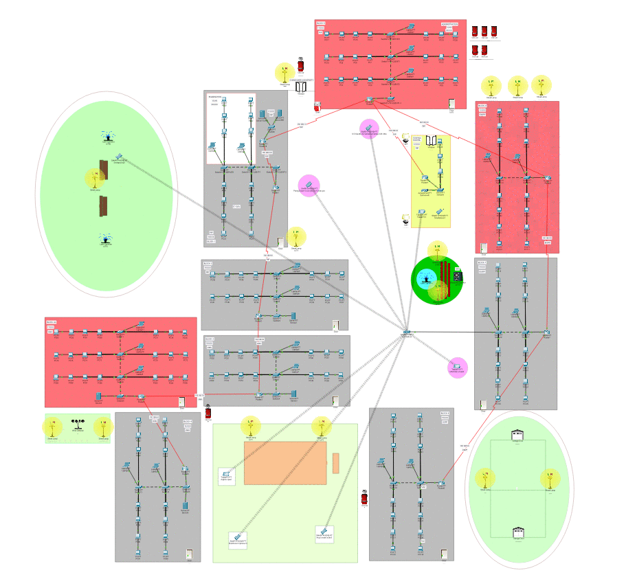

**NOTE: The network structure is not the exact replica of the network of Chandigarh University.** 

The project covers the 
- Different routing protocols (RIP, EIGRP, OSPF)
- IP addressing through DHCP
- Network Address Translation(NAT)
- VLAN(Router on a stick)
- Internetworking across the campus  

The video portfolio: [Link to video](https://drive.google.com/file/d/17BRTzqIst3FMfrjo2Sk9fW2jzFtckwyJ/preview), displays the various concepts and implementation used in the project. 

